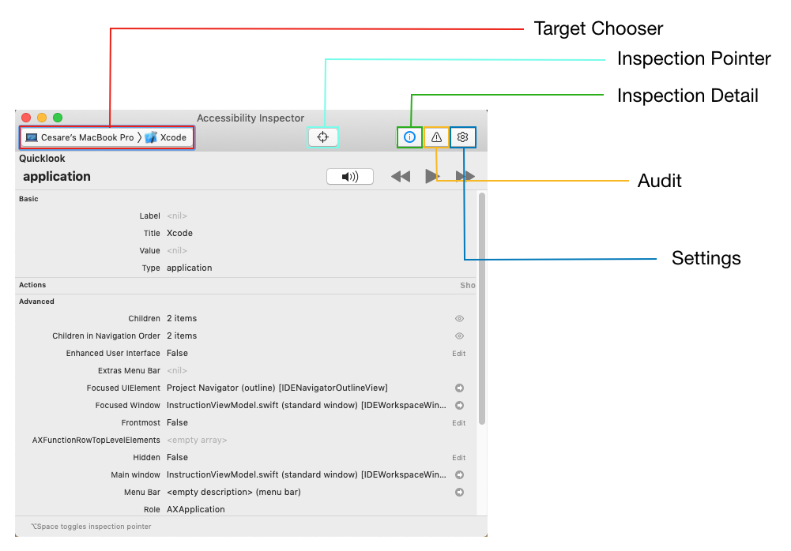

# ACCESSIBILITY INSPECTOR

**Xcode** > **Open Developer Tool** > **Accessibility Inspector**

Facilitates a11y. Features:

1. Runs app and finds common a11y issues.
2. Checks a11y attribs of elements in **Inspection Mode**.
3. Provides live previews of a11y elements without leaving app.
4. Supports all platforms including macOS, iOS, watchOS, and tvOS.

## Target Chooser

Selects device. E.g., iPhone, Simulator.

## Inspection Pointer

Enable it is similar to enabling VoiceOver. When activated, can hover over UI element to check its attributes. Interacting with simulator directly via button presses deactivates Inspection Pointer.

_Not working as of Xcode 11.3.1, iOS 13.3, macOS 10.15.3._

## Inspection Detail

* **Basic**: Attribute properties for currently-highlighted element.
* **Actions**: To perform action like tapping button or scrolling view. Pressing **Perform** button in this pane performs action on target.
* **Element**: Displays class, address, and controller of current item. May not work consistently.
* **Hierarchy**: Shows view hierarchy of element.

## Quicklook

Simulates VoiceOver audio. Click speaker button to toggle sound.

**Play** button cycles through accessible elements in app automatically. **Forward** or **Back** button steps through manually.

## Audit

Press **Run** button to check for a11y problems in app, presented as warnings.

Click individual warning to highlight related element in simulator and bottom of Audit screen.

Click question mark to see fix suggestion.

Click eye button to take snapshot.

## Settings

To test other common a11y options like font size.
