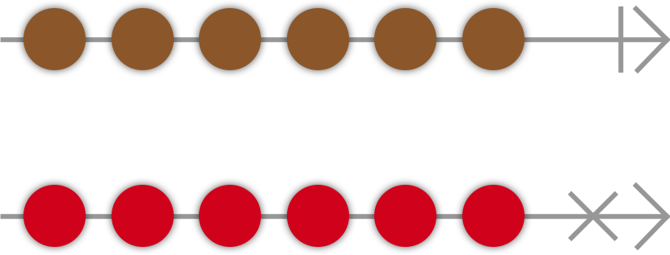

# COMBINE

Framework implementing functional reactive programming (FRP) paradigm. Heavily used by SwiftUI.

## FRP

Data flows from one place to other automatically through subscriptions.

Particularly useful when data changes over time.

E.g., use FRP to push value of slider to stream, or use publisher to send value to subscribers, which could be label showing slider value, or something else.

In addition to driving UI updates, also useful in asynchronous programming. E.g., when making network request, get result back eventually. Instead of executing completion closure, request method would return publisher, which publishes result when request done. If result needs to be transformed, or need to chain with another request, easier to read code than nested tree of completion closures.

## Publisher and Subscriber

Publisher object sends values to subscribers over time. Could be single, multiple, or no values. Can only emit single completion or error event. Publisher flow commonly represented by _marble diagram_:



Each arrow is publisher. Marble is value emitted. Top arrow has line at end representing completion event. Bottom arrow has cross representing error event. After either event, no more value.

### Code Example

Can model value stream with array.

```swift
[1, 2, 3]
  .publisher
  .sink(receiveCompletion: { completion in
    switch completion {
    case .failure(let error):
      print("Something went wrong: \(error)")
    case .finished:
      print("Received Completion")
    }
  }, receiveValue: { value in
    print("Received value \(value)")
  })

// Received value 1
// Received value 2
// Received value 3
// Received Completion
```

Combine adds `publisher` property to `Array`. Turns array of values into publisher to publish values to subscribers.

Created publisher type is `Publishers.Sequence<[Int], Never>`. `Publishers` is enum used as namespace for all publishers. Each publisher conforms to `Publisher`, but rarely created directly.

Generic types `[Int]` and `Never` mean publisher uses sequence type `[Int]` to publish values, and its failure type is `Never`, so it always completes successfully, never reaches `.failure` case in example `switch`.

Every publisher has `Output` and `Failure` type. `Output` is value type publisher pushes to subscribers. In above example `Sequence`, `Output` is `Int`, `Failure` is `Never`. Publisher that can fail often uses object conforming to `Error` as `Failure` type, but can specify other type.

Subscribe to publisher with `sink(receiveCompletion:receiveValue:)`. There is special version if publisher has failure type `Never`, only need to supply `receiveValue` closure. Publisher only publishes values when there is subscriber. This method creates subscriber immediately and enables publisher to begin streaming values.

`receiveValue` closure called each time new value is published, value received as its single arg.

## Tracking Subscriptions

Typically need to hold on to return type of `sink()`, or subscriber discarded when out of scope. Return type is `AnyCancellable`: type-erased wrapper around `Cancellable`. Can explicitly cancel subscription (`subscription.cancel()`), or automatically canceled when deallocated.

```swift
var subscription: AnyCancellable?

func subscribe() {
  let notification = UIApplication.keyboardDidShowNotification
  let publisher = NotificationCenter.default.publisher(for: notification)
  subscription = publisher.sink(receiveCompletion: { _ in
    print("Completion")
  }, receiveValue: { notification in
    print("Received notification: \(notification)")
  })
}

subscribe()
NotificationCenter.default.post(Notification(name: UIApplication.keyboardDidShowNotification))
```
