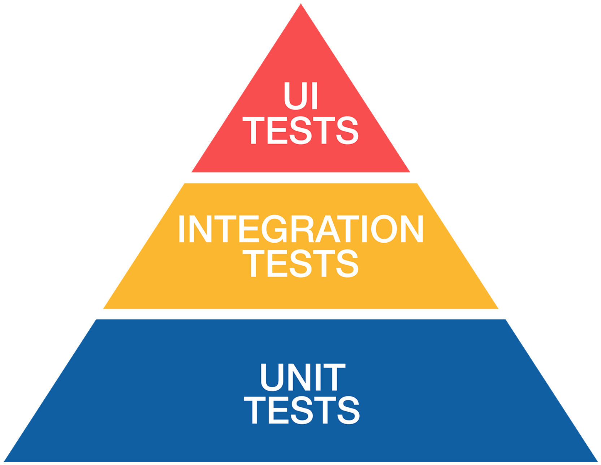

# TEST PYRAMID

Stack representing different types of tests. All needed to effectively quality-assure app.

When going up stack, tests become slower, less stable, and less common. Tests are "flaky" when indeterministic (e.g., give different results in repeated runs); devs stop trusting them as accurate measure of code health.

## Unit Tests

Designed to test atomic unit of functionality. Most common. Should be **FIRST**:

* **Fast:** Faster they are, more often they'll be run.
* **Isolated:** One test should not depend on another having run, or any external state.
* **Repeatable:** They should always give same result when run, regardless of how many times or when they are run.
* **Self-verifying:** Test should unambiguously say whether it passed or failed, with no room for interpretation.
* **Timely:** They should be written before or alongside production code.

Unit tests assure atomic bits of code work, so when combined into bigger parts, those work too.

Since code is tested in isolation, if other components involved, often simulated with test doubles to keep test simple.

## Integration Tests

Test different components combine to complete specific task correctly. E.g., unit tests verify A, B, and C work in isolation, then create integration test to verify A -> B -> C leads to D.

Should still be isolated and repeatable, but may not be fast, self-verifying (may require manual check of result), and timely.

## UI Tests

App is manipulated to check that things work as expected. May be manual, but a lot can be automated with `XCTest`.

UI tests don't have access to app code (so `@testable` not helpful). App is run in simulator, and UI tests simulate user interaction to manipulate app.

More accurately reflect real-world usage (can only do what user can do), but are slow, harder to track errors, and tests like snapshots (comparing screenshots) may be brittle if UI changes frequently.

## Test Flow

1. Compiler checks. Static.
2. Unit, integration, and UI tests. Some prefer different engineers writing tests than code authors.
3. Continuous integration runs tests externally. May run subset of tests as "smoke tests" (most important functionalities).
4. QA engineers manually test against test sheets or grids, or fuzz test (randomly and rapidly hitting UI).
5. Hallway test / dogfooding. Get other users within organization, or use app myself.
6. Use service such as TestFlight to get test users.
7. Production test -- ship and let real users find bugs. It all gets tested eventually.

Preferably do as much 1-6 before 7.
